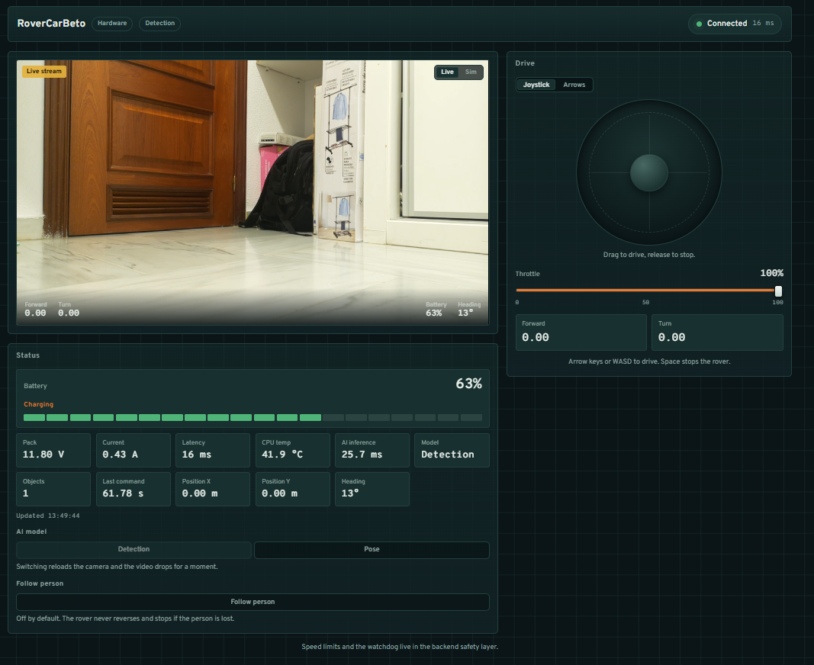
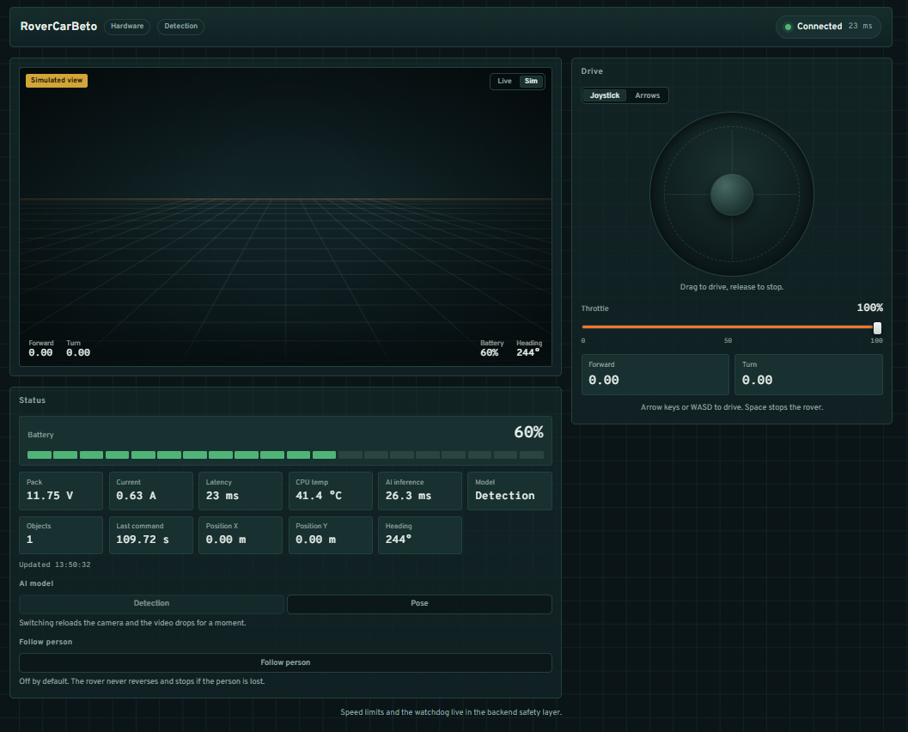
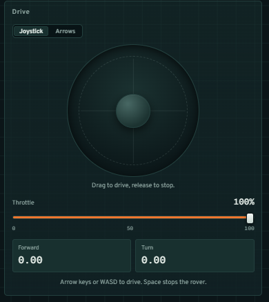
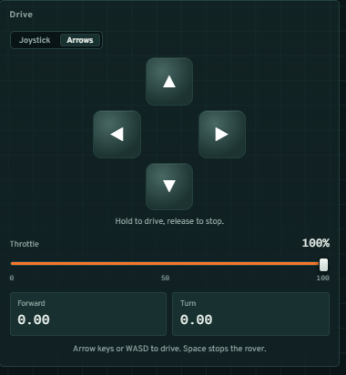

# RoverCarBeto

4WD rover based on a **Raspberry Pi 5** and the **Waveshare WAVE ROVER** chassis, with
remote control, a web interface, live video, telemetry, and AI. Developed
**AI-first** following the rules in [`AGENTS.md`](AGENTS.md).

> Current status: **Phases 1-6 implemented, Phase 7 started**. Foundation,
> simulated rover, web interface, real WAVE ROVER hardware, live video
> (simulator + IMX500), and AI (detection, pose, tracking) are done and verified
> on the unit. Phase 7 (intelligent behavior) has begun with **person following**;
> the rest of Phase 7 and Phase 8 (autonomy) are still to come. Development stays
> fully runnable in `simulator` mode without any hardware.

---

## 1. What is implemented

**Backend**

- **FastAPI** with a versioned API under `/api/v1`.
- **Rover** layer with an abstract interface and interchangeable
  implementations: the **simulator**, the **`WaveRoverWifiDriver`** (HTTP over
  the chassis AP), and the **`WaveRoverSerialDriver`** (40-pin header UART).
- **Safety layer**: validation, speed clamping, and limits.
- **Watchdog**: if no new command arrives, the rover stops by itself.
- **STOP** with priority that never returns an error to the client.
- **Telemetry**: rover status, SoC temperature, last inference time, and
  detection count.
- Unit and integration **tests** (pytest) + lint (ruff).

**Live video (Phase 5)**

- **Camera** layer with an abstract interface and two implementations: the
  **simulator** (synthetic signal) and the real **IMX500** camera.
- **MediaMTX** as the only intermediary: RTSP on input, **WebRTC (WHEP)** on output.
- The simulator publishes with **FFmpeg** (`testsrc2`); the real camera uses the
  Pi's **hardware H.264 encoder**.
- Everything **ephemeral**: no frame is recorded or persisted.

**AI and computer vision (Phase 6)**

- The neural network runs **inside the IMX500 sensor**, not on the Pi. The sensor
  holds **one network at a time**.
- **Object detection** (SSD-MobileNetV2-FPNLite, 80 COCO classes) and **pose
  estimation** (HigherHRNet-COCO, 17 joints), with measured rates of
  ~8.5 and ~3 updates per second respectively.
- **Tracking**: identities are kept across frames.
- Results are pushed over a **WebSocket** (`/ai/stream`) as the sensor produces
  them, and drawn as **boxes / skeletons** over the video.
- The network can be switched **from the interface** (the "AI model" selector).
- **Nothing is recorded**: detections live only in memory and are replaced by the
  next result. See [`docs/specs/ai-detection.md`](docs/specs/ai-detection.md) and
  [`docs/specs/imx500.md`](docs/specs/imx500.md).

**Behaviour (Phase 7)**

- **Person following**, off by default: when an operator enables it, the rover
  **chases** a detected person — turning to keep them centred and advancing until
  they are close (minimum distance). It follows the pipeline
  `Perception → Decision → Safety → Motion`, all through the existing service
  layer; it **never reverses** and stops the moment the target is lost.

**Frontend**

- **React + TypeScript + Vite**, with no external state libraries.
- Touch/mouse **joystick** and **arrow-key keyboard**, switchable via tabs
  in the Drive panel. With either one: hold to move and release to stop.
- **Throttle** control: limits the robot's rate and can never
  exceed the backend limits. It is shared: it applies to both the joystick and
  the arrow keys.
- **Stop** on releasing the control, the **Space** key, and the backend watchdog.
- **Connection status** and live **telemetry** (battery, latency, temperature).
- **Fault isolation**: each panel is wrapped in an `ErrorBoundary`, so a
  camera or telemetry failure does not leave the operator without controls.
- **Live video** panel over WebRTC, from the simulator or the real IMX500 camera,
  with **detection/pose overlays** and the **AI model** selector.

**Infrastructure**

- **Docker / Docker Compose** with three services: `api`, `mediamtx` (video),
  and `ui`. `docker-compose.pi.yml` is the Raspberry Pi override.

Remaining work: the rest of Phase 7 (obstacle warnings, semi-autonomous actions)
and Phase 8 (autonomy). **Technical debt** and one-off improvements (not tied to
a phase) are tracked in [`TASKS.md`](TASKS.md).

---

## 2. Target hardware

| Component    | Detail                               |
| ------------ | ------------------------------------ |
| Controller   | Raspberry Pi 5                       |
| Chassis      | Waveshare WAVE ROVER 4WD             |
| Camera       | Raspberry Pi AI Camera (Sony IMX500) |
| Storage      | NVMe SSD via an M.2 / PCIe adapter   |
| Connectivity | Wi-Fi                                |

The Raspberry Pi **does not control the motors over GPIO**: it communicates with the
WAVE ROVER electronics over the chassis **Wi-Fi AP** (HTTP, default) or over the
**header UART** (serial) — both speak the same JSON protocol.

---

## 3. Architecture

```text
React (Phase 3)
      │  HTTP / WebSocket
      ▼
FastAPI  ──────────────►  Camera / AI (Phases 5-6)
      │
      ▼
RoverService  (watchdog + orchestration)
      │
      ▼
SafetyLayer  (validation + limits)
      │
      ▼
Rover (interface)
 ├── WaveRoverSimulator     ← no hardware
 ├── WaveRoverWifiDriver    ← chassis AP (Phase 4)
 └── WaveRoverSerialDriver  ← header UART (Phase 4)
      │
      Wi-Fi / UART
      ▼
WAVE ROVER → 4WD
```

Key principle: **React never touches the hardware**; all motion goes through
API → Service → Safety → Driver.

Diagrams: [`diagrams/architecture.md`](diagrams/architecture.md).

---

## 4. Installation and local run

### Requirements

- Python 3.12+ (tested with 3.12/3.14)
- Optional: Docker and Docker Compose

### Without hardware (simulator mode, default)

```powershell
# 1. Virtual environment + dependencies
powershell -ExecutionPolicy Bypass -File scripts/dev.ps1

# 2. Configuration (optional, the defaults already work)
Copy-Item .env.example .env

# 3. Start the API
.venv\Scripts\python.exe -m uvicorn app.main:app --reload
```

Open <http://127.0.0.1:8000/docs> for the interactive documentation.

### Web interface (frontend)

With the backend running, in another terminal:

```powershell
cd frontend
npm install
npm run dev
```

Open <http://localhost:5173>. Vite's dev server proxies
`/api` to `http://127.0.0.1:8000`, so the browser only talks to a
single origin (no CORS).

**API types:** the frontend gets them from the backend OpenAPI, not by hand.
After changing any backend model, regenerate:

```powershell
# with the backend running (simulator mode is enough)
cd frontend
npm run gen:api              # writes src/types/api.ts
ROVER_API_URL=http://host:8000/openapi.json npm run gen:api   # remote backend
```

`src/types/rover.ts` re-exports those types; if the backend stops providing one
the frontend uses, generation **fails instead of drifting silently**. If
port 8000 is taken (for example, by a Docker container), use another one and
point to it with `ROVER_API_URL`.

Controls: **drag the joystick** and **release it to stop**, use the **arrow keys or
WASD**, adjust the **throttle** to limit the rate, or
press **Space** for an immediate stop.

Stopping is redundant on purpose: releasing the joystick, the Space key, the
backend watchdog (if no commands arrive), and the `POST /rover/stop` endpoint.

### With Docker Compose

```bash
docker compose up --build
```

- Web interface (nginx): <http://127.0.0.1:8080>
- Direct API: <http://127.0.0.1:8000>

Services: `api`, `mediamtx` (video), and `ui`. The MediaMTX diagnostics API
is published **only on `127.0.0.1`**:

```bash
curl http://127.0.0.1:9997/v3/paths/list   # is the stream online?
```

The `ui` container serves the compiled frontend and proxies `/api` to the
`api` container.

The published ports can be changed with environment variables (useful if
8080 is already taken on your machine):

```bash
# Linux / macOS
UI_PORT=8081 API_PORT=8001 docker compose up --build

# Windows (PowerShell)
$env:UI_PORT = "8081"; $env:API_PORT = "8001"; docker compose up --build
```

To stop the stack: `docker compose down`.

### On the Raspberry Pi (AI camera / IMX500)

```bash
# On the Pi, with the project copied (e.g. ~/rovercarbeto)
docker compose -f docker-compose.yml -f docker-compose.pi.yml up -d --build
```

- Interface: `http://<pi-ip>:8081`
- API: `http://<pi-ip>:8001`
- Video (WHEP): `http://<pi-ip>:8889/rover/whep`

The `docker-compose.pi.yml` override changes three things:

| What                                                              | Why                                                                                        |
| ----------------------------------------------------------------- | ------------------------------------------------------------------------------------------ |
| `Dockerfile.pi`                                                   | `picamera2` and `libcamera` are **not in Debian**: they come from the Raspberry Pi archive |
| `privileged: true` + `/dev`, `/sys`, `/run/udev`, `/lib/firmware` | without `/dev/dma_heap` the driver fails with _"Could not open any dmaHeap device"_        |
| `MTX_WEBRTCADDITIONALHOSTS=<pi-ip>`                               | the browser reaches MediaMTX through the published port, so ICE must advertise that IP     |

The API is published on **8001** so it does not collide with anything already
running on the board, and `ports` use `!override` because **Compose** _appends_
lists when merging files: without that tag, 8000 and 8080 would be published as well.

#### Two already-solved pitfalls (in case it has to be rebuilt)

1. **The Raspberry Pi repository key.** You must install the
   `raspberrypi-archive-keyring` package, **not** the standalone `raspberrypi.gpg.key`:
   that one carries SHA-1 signatures and `sqv` rejects them since 2026-02-01, so
   `apt-get update` fails with code 100 (_"Signing key ... is not bound"_).
2. **The container user must be in the `sudo` group (gid 27).**
   `picamera2` reads firmware progress from `/sys/kernel/debug`, which is
   `root:sudo 0750`. Without that group it falls into the branch that runs
   `sudo -n debug_stream_imx500.sh`; since `sudo` is not installed, `start()`
   dies with `FileNotFoundError` (a picamera2 bug: it only catches
   `CalledProcessError`, not `FileNotFoundError`).

The camera startup takes **~45–50 s** the first time (firmware upload to the
sensor) and considerably less afterwards. It happens when the stack comes up if
`CAMERA_AUTOSTART=true`.

#### Video flip

If the camera is mounted upside down on the chassis:

```env
# 180 degrees = both at once
CAMERA_HFLIP=true
CAMERA_VFLIP=true
```

They are libcamera's native flags, so setting **only one** covers a
mirrored mounting. They are already enabled in `docker-compose.pi.yml`.

> About detections: the mirror affects **only the video**, and the inference boxes
> are **not** mirrored. Verified on the unit: with picamera2's official
> conversion (`convert_inference_coords`) the boxes land on top of the objects without
> applying any rotation. Applying it was precisely what decentered them. See
> [`docs/specs/imx500.md`](docs/specs/imx500.md).

#### Rover hardware mode (Phase 4)

The WAVE ROVER base creates its own Wi-Fi network: the Pi joins it through `wlan1`
and reaches it at **192.168.4.1**.

```env
ROVER_MODE=hardware
WAVE_ROVER_HOST=192.168.4.1
WAVE_ROVER_PORT=80
WAVE_ROVER_TIMEOUT=1.0
```

`docker-compose.pi.yml` already sets `ROVER_MODE=hardware` by default, so the Pi
stack drives the real chassis. The driver
(`app/rover/wave_rover_wifi.py`) is implemented against the official WAVE ROVER
protocol; the verified details, the calibration values of this unit, and the
battery model are in [`docs/specs/wave-rover.md`](docs/specs/wave-rover.md).

The transport is selectable with `WAVE_ROVER_TRANSPORT`:

- `wifi` (default): HTTP over the chassis AP (`192.168.4.1`).
- `serial`: the same JSON protocol over the **40-pin header UART** at 115200
  (`/dev/ttyAMA0`) — the official method, and the Pi is already mounted on the
  chassis, so no extra cabling is needed (**benched and verified** on the unit).
  It requires the header UART enabled (`dtparam=uart0=on`,
  `dtoverlay=disable-bt`, no serial console) — see `docs/specs/wave-rover.md`.

Calibration (chassis speed rate, per-wheel trim, battery curve) is adjusted from
the Pi's `.env` **without rebuilding the image**.

Safety on the real rover: the chassis has its own **3-second heartbeat** and stops
by itself if it stops receiving commands; our watchdog stops it after `0.5 s` with
no new command. No test triggers physical motion.

---

## 5. Configuration

All configuration is defined through environment variables (see `.env.example`).
Secrets are never committed to the repository.

| Variable                   | Default                                     | Description                                            |
| -------------------------- | ------------------------------------------- | ------------------------------------------------------ |
| `APP_NAME`                 | `RoverCarBeto`                              | Application name shown by FastAPI                      |
| `APP_VERSION`              | `0.1.0`                                     | Reported version                                       |
| `ENVIRONMENT`              | `development`                               | Environment label (the Docker stack uses `docker`)     |
| `LOG_LEVEL`                | `INFO`                                      | Logging level                                          |
| `API_HOST`                 | `0.0.0.0`                                   | API bind address                                       |
| `API_PORT`                 | `8000`                                      | API bind port                                          |
| `ROVER_MODE`               | `simulator`                                 | `simulator` or `hardware`                              |
| `CAMERA_MODE`              | `simulator`                                 | `simulator` or `imx500`                                |
| `CAMERA_AUTOSTART`         | `true`                                      | Start the video publisher with the API                 |
| `CAMERA_WIDTH`             | `1280`                                      | Stream width                                           |
| `CAMERA_HEIGHT`            | `720`                                       | Stream height                                          |
| `CAMERA_FPS`               | `30`                                        | Frames per second                                      |
| `CAMERA_BITRATE_KBPS`      | `2500`                                      | Encoder bitrate (lower it on a weak link)              |
| `CAMERA_STREAM_PATH`       | `rover`                                     | Stream path in MediaMTX                                |
| `CAMERA_NETWORK_FILE`      | `...ssd_mobilenetv2_fpnlite_320x320_pp.rpk` | Network uploaded to the IMX500 sensor                  |
| `CAMERA_BUFFER_COUNT`      | `3`                                         | Picamera2 capture buffers (fewer = less latency)       |
| `CAMERA_HFLIP`             | `false`                                     | Mirror the stream horizontally                         |
| `CAMERA_VFLIP`             | `false`                                     | Mirror the stream vertically                           |
| `AI_SCORE_THRESHOLD`       | `0.5`                                       | Minimum confidence to report a detection               |
| `AI_POSE_THRESHOLD`        | `0.3`                                       | Minimum confidence for the pose network                |
| `FOLLOW_AUTO_ENABLE`       | `false`                                     | Enable person following at startup                     |
| `FOLLOW_TARGET_LABEL`      | `person`                                    | COCO label to follow                                   |
| `FOLLOW_MIN_CONFIDENCE`    | `0.5`                                       | Minimum person confidence to follow                    |
| `FOLLOW_TARGET_HEIGHT`     | `0.7`                                       | Approach until the person is this tall (min. distance) |
| `FOLLOW_MAX_LINEAR`        | `0.4`                                       | Follow forward-speed cap                               |
| `FOLLOW_MAX_ANGULAR`       | `0.6`                                       | Follow turn-speed cap                                  |
| `FOLLOW_MIN_LINEAR`        | `0.15`                                      | Smallest forward speed (beats static friction)         |
| `FOLLOW_DEADBAND`          | `0.06`                                      | Dead zone for the centre/height errors                 |
| `FOLLOW_FACE_DEADBAND`     | `0.2`                                       | Drive forward only within this of the centre           |
| `FOLLOW_LOST_TIMEOUT`      | `10.0`                                      | Seconds without a target before it disables            |
| `MEDIAMTX_HOST`            | `localhost`                                 | MediaMTX host as seen by the backend                   |
| `MEDIAMTX_RTSP_PORT`       | `8554`                                      | RTSP publish port                                      |
| `MEDIAMTX_WEBRTC_PORT`     | `8889`                                      | WebRTC/WHEP port (used by the browser)                 |
| `MAX_LINEAR_SPEED`         | `1.0`                                       | Linear speed limit                                     |
| `MAX_ANGULAR_SPEED`        | `1.5`                                       | Angular speed limit                                    |
| `COMMAND_TIMEOUT`          | `0.5`                                       | Seconds without a command before automatic STOP        |
| `WATCHDOG_INTERVAL`        | `0.1`                                       | Watchdog check period                                  |
| `WAVE_ROVER_HOST`          | `192.168.1.100`                             | WAVE ROVER IP (the unit's AP is `192.168.4.1`)         |
| `WAVE_ROVER_PORT`          | `80`                                        | WAVE ROVER port                                        |
| `WAVE_ROVER_TRANSPORT`     | `wifi`                                      | `wifi` (HTTP) or `serial` (header UART)                |
| `WAVE_ROVER_SERIAL_PORT`   | `/dev/ttyAMA0`                              | UART device when `WAVE_ROVER_TRANSPORT=serial`         |
| `WAVE_ROVER_TIMEOUT`       | `1.0`                                       | Network timeout per operation (s)                      |
| `WAVE_ROVER_MAX_SPEED`     | `0.5`                                       | Chassis speed that maps to full internal speed         |
| `WAVE_ROVER_SPEED_RATE`    | `1.0`                                       | Chassis speed rate applied on connect (0..1)           |
| `WAVE_ROVER_LEFT_TRIM`     | `1.0`                                       | Left-wheel trim (1.0 = no correction)                  |
| `WAVE_ROVER_RIGHT_TRIM`    | `1.0`                                       | Right-wheel trim (1.0 = no correction)                 |
| `WAVE_ROVER_BATTERY_CURVE` | 3S Li-ion curve                             | `(voltage_V, percentage)` pairs; see `.env.example`    |
| `SIMULATOR_LATENCY`        | `0.0`                                       | Simulated round-trip latency (s)                       |
| `SIMULATOR_FAILURE_RATE`   | `0.0`                                       | Simulated failure probability (0..1)                   |

The values above are the code defaults (`app/core/config.py`). `.env.example`
documents each one with comments, and the real `.env` — with the calibration of
this particular unit — is kept on the Pi and **is never committed**.

---

## 6. API

Base: `/api/v1`

| Method | Route              | Description                            |
| ------ | ------------------ | -------------------------------------- |
| GET    | `/health`          | Service status                         |
| GET    | `/rover/status`    | Rover status                           |
| POST   | `/rover/move`      | Apply a motion command                 |
| POST   | `/rover/stop`      | Stop the rover (STOP)                  |
| GET    | `/telemetry`       | Telemetry snapshot                     |
| GET    | `/camera/status`   | Live video stream status               |
| GET    | `/ai/detections`   | Detected objects with their boxes      |
| GET    | `/ai/pose`         | People with their joints               |
| GET    | `/ai/models`       | Available networks and which is active |
| POST   | `/ai/model`        | Load another network into the sensor   |
| WS     | `/ai/stream`       | Results pushed to the browser          |
| GET    | `/behavior/status` | Follow behaviour status                |
| POST   | `/behavior/follow` | Enable or disable person following     |

The sensor carries **one network loaded at a time**, so only one of the two
AI endpoints has data: the other responds `available: false` instead of
inventing anything.

`POST /ai/model` switches networks **from the interface** (the "AI model" selector in the
Status panel). Switching networks **restarts the camera**: the video drops while the
sensor boots with the new firmware. The request **only responds when
publishing is live again**, so the "Reloading network…" window covers
the whole restart instead of disappearing halfway (measured: the POST lasts as long
as the real return of the stream). It is rejected (409) if the rover is moving.
Only networks the backend knows how to interpret are offered. The stream
watchdog (T-003) respects an in-progress switch (`is_reloading`) and never fights it.

`/ai/stream` is a WebSocket: the backend sends each result **as soon as the sensor
produces it**, instead of the browser polling. Measured, this arrives with 0 ms of
added delay; polling lost results and added up to 250 ms.

```bash
curl -X POST http://127.0.0.1:8000/api/v1/rover/move \
  -H "Content-Type: application/json" \
  -d '{"linear": 0.5, "angular": -0.2}'

curl -X POST http://127.0.0.1:8000/api/v1/rover/stop
```

`linear`/`angular` values normalized to `[-1, 1]`:

- non-finite values (`NaN`, `Infinity`) are **rejected** (422);
- values that exceed the configured limits are **clamped**;
- every motion command arms the **watchdog**.

---

## 7. Simulator

It is a first-class part of the project. It simulates:

- connection/disconnection and **link loss**;
- network latency;
- communication timeouts;
- battery drain (progressive discharge);
- virtual position and orientation;
- latency and age of the last command.

The default `ROVER_MODE=simulator` / `CAMERA_MODE=simulator` keeps the whole
project runnable and testable without any hardware.

---

## 8. Tests and quality

```powershell
# Backend
.venv\Scripts\python.exe -m pytest
.venv\Scripts\python.exe -m ruff check .
.venv\Scripts\python.exe -m ruff format --check .

# Frontend
cd frontend
npm test
npm run typecheck
npm run build
```

Critical cases covered:

- STOP always works (even without a link);
- invalid command rejected; out of range, clamped;
- Wi-Fi loss changes the state to `disconnected`;
- the watchdog stops motion if no commands arrive;
- the API does not block on a rover timeout;
- the simulator behaves like the expected rover;
- a camera failure does not block manual control.

---

## 9. Structure

```text
AGENTS.md           # project rules
README.md
MEMORY.md           # protected decisions: read before refactoring
TASKS.md            # technical debt and improvements
docs/specs/         # per-subsystem specifications
app/
├── ai/           # detection, pose, tracking, follow, broadcast, model catalog
├── api/          # routes, schemas, and dependencies
├── camera/       # interface, simulator, IMX500, stream, health, factory
├── core/         # configuration, logging, exceptions
├── rover/        # interface, safety, simulator, wifi/serial drivers, service, factory
├── telemetry/    # telemetry service
└── main.py       # FastAPI application
frontend/
├── src/
│   ├── components/   # Joystick, VideoPanel, DetectionOverlay, PoseOverlay...
│   ├── hooks/        # useRover, useFollow, useCameraModels, useAiStream, useLiveVideo
│   ├── lib/          # pure, testable logic (motion, roverState, stream)
│   ├── pages/        # DrivePage
│   ├── services/     # API client
│   └── types/        # types shared with the backend
├── index.html
└── vite.config.ts
tests/
├── unit/
└── integration/
docker/             # nginx and MediaMTX configuration
scripts/
```

---

## 10. Live video

Specification: [`docs/specs/live-video.md`](docs/specs/live-video.md).

```text
camera (Picamera2 / simulator)
        │  RTSP
        ▼
     MediaMTX  ──►  WebRTC (WHEP)  ──►  <video> in React
```

- **MediaMTX does not record**: `record: false` is set in `docker/mediamtx.yml`.
- The **simulator** publishes a synthetic signal (`testsrc2`) with FFmpeg, with
  `-tune zerolatency` and one keyframe per second so the video hooks up quickly.
- The publisher is **supervised**: if FFmpeg dies, it restarts with bounded
  backoff and the reason stays in `last_error`.
- The real camera uses the Pi's **hardware H.264 encoder** (`H264Encoder` over
  V4L2), and a stream watchdog restarts it if the publisher dies (T-003).
- The WHEP URL is assembled by **the browser** with its own hostname; the backend
  only exposes `stream_path` and `webrtc_port`, because MediaMTX's host inside
  Docker is not resolvable from the browser.
- Replacing the simulator with the real camera (IMX500) is a matter of swapping one
  `Camera` implementation: **neither the API, nor the frontend, nor the transport change**.

Check that the stream is live:

```bash
curl -s http://127.0.0.1:8000/api/v1/camera/status   # running, last_error
curl -s http://127.0.0.1:9997/v3/paths/list          # ready, tracks, readers
```

### Latency

Measured with real WebRTC statistics (`RTCPeerConnection.getStats()`):

| Metric                  | Simulator (loopback) | IMX500 camera (Wi-Fi)   |
| ----------------------- | -------------------- | ----------------------- |
| WHEP handshake          | 8 ms                 | —                       |
| Network RTT             | 1 ms                 | 19–85 ms                |
| Browser _jitter buffer_ | 17.9 ms              | 39–130 ms               |
| Frames decoded / lost   | 298 / 0              | 0 losses on a good link |

Conclusion: **the WebRTC transport contributes ~20 ms**. The rest of the budget is
in capture and encoding, and in the network.

Already applied:

- `-tune zerolatency`, `-profile:v baseline`, and `-g <fps>` in the simulated publisher.
- **Hardware H.264 encoder** on the Pi (`H264Encoder` over V4L2), not software.
- `CAMERA_BUFFER_COUNT=3`: fewer buffers, fewer queued frames.
- `jitterBufferTarget = 0` and `playoutDelayHint = 0` in the browser receiver.

#### The pipeline is not the bottleneck

Measured **locally inside the Pi**, with no network in between:

```text
ffmpeg -i rtsp://mediamtx:8554/rover -f null -
frame= 342  fps= 31  time=00:00:12.00  speed=1.09x
real bitrate: 2641 kbit/s
```

30 fps sustained in real time. If the video looks slow, **it is the network**.

#### Network requirement

This matters more than any code tweak:

- **The link dominates.** A sustained ping should give <5 ms average and 0%
  loss. With 3–5% loss, WebRTC **enlarges its jitter buffer** to
  compensate (130 ms was measured), and that is exactly what is perceived as
  slowness.
- **Avoid channel 1 on 2.4 GHz.** In one real installation there were _five_ networks
  on channel 1, including the Pi's and the WAVE ROVER's own AP. Moving the
  router to a free channel (6 or 11) is the highest-impact fix.
- **Avoid the double Wi-Fi hop.** If the PC is also on Wi-Fi, the video crosses
  the air twice. Wiring the PC (or the Pi, which has `eth0`) removes half
  the problem.
- **Match the bitrate to the link.** Lowering `CAMERA_BITRATE_KBPS` (e.g. 1200)
  reduces occupied airtime and losses, at the cost of quality.

> Note: `jitterBufferTarget = 0` minimizes latency, but over a lossy link
> that is paid for in stutter. On a bad network, the buffer is protective.

The **control** latency is independent: commands go over the HTTP API,
not the video. The video only determines how long it takes you to _see_ the result.

---

## 11. AI and computer vision

The inference runs **inside the IMX500 sensor**, so it costs the Pi almost
nothing. The sensor holds **one network at a time**; switching it restarts the
camera.

| Task             | Network                              | Output                          | Measured rate  |
| ---------------- | ------------------------------------ | ------------------------------- | -------------- |
| Object detection | `ssd_mobilenetv2_fpnlite_320x320_pp` | Boxes + labels, 80 COCO classes | ~8.5 updates/s |
| Pose estimation  | `higherhrnet_coco`                   | 17 joints, up to 30 people      | ~3 updates/s   |

- **Boxes and skeletons** are drawn over the video with an SVG overlay that
  replicates the video's `object-fit: cover`, so they do not drift when cropping.
- **Tracking** (`app/ai/tracking.py`) keeps an identity per object across frames.
- Results are delivered on the **WebSocket** `/ai/stream`, so the browser sees
  each inference as it happens instead of polling.
- **Telemetry** reports `ai_inference_ms` and the detection count.
- The loaded network is chosen from the interface and can be switched live; the
  switch is **refused while the rover is moving** (409) because the operator is
  briefly blind.
- The coordinate mapping was validated against the live video; the pitfalls that
  were fixed are documented in [`docs/specs/ai-detection.md`](docs/specs/ai-detection.md).

**Nothing is recorded.** Tensors and detections live in memory, and each result
replaces the previous one.

### Person following (Phase 7)

Turned off by default. Enable it from the API (or `FOLLOW_AUTO_ENABLE=true` at
startup):

```bash
# who is being followed, and whether it is on
curl -s http://127.0.0.1:8000/api/v1/behavior/status

# enable (409 if the rover is not connected)
curl -X POST http://127.0.0.1:8000/api/v1/behavior/follow \
  -H "Content-Type: application/json" -d '{"enabled": true}'

# always stops the rover immediately
curl -X POST http://127.0.0.1:8000/api/v1/behavior/follow \
  -H "Content-Type: application/json" -d '{"enabled": false}'
```

How it behaves:

- It **chases the largest person**: it turns to keep them centred and advances
  until they are close, then holds that **minimum distance** (it never reverses).
- It only drives forward while the person is roughly centred
  (`FOLLOW_FACE_DEADBAND`); off to the side it turns in place instead of driving
  diagonally.
- The moment the person disappears it **stops**; if they do not come back within
  `FOLLOW_LOST_TIMEOUT` it disables itself, so a brief loss can be recovered.
- Every command goes through the rover service, so the safety layer clamps it and
  the watchdog stays armed: if the behaviour dies, the rover stops.

---

## 12. Camera privacy

The camera will be used **only** for live video and real-time inference.
Videos are **not** recorded and images are not saved to disk at any phase.

## UI



# Simulator



# Control Panel

Joystick



Arrows


