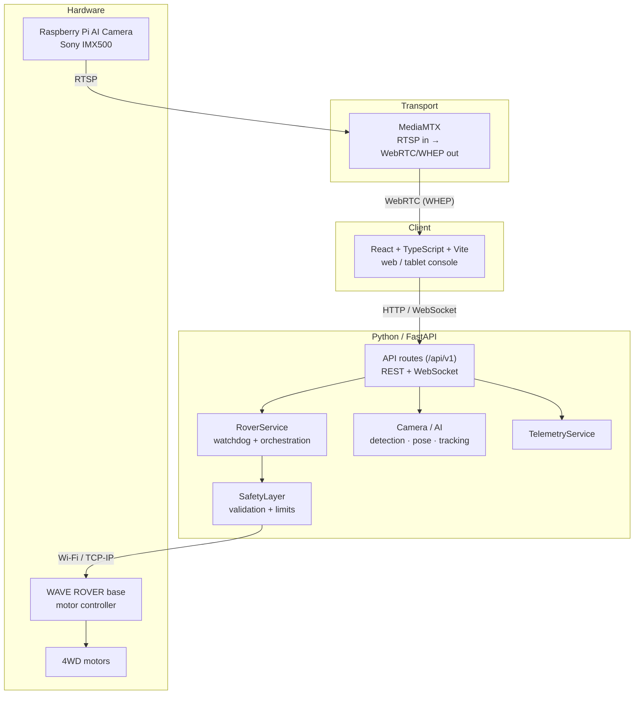
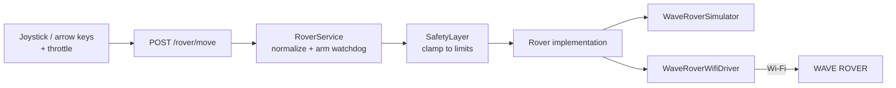
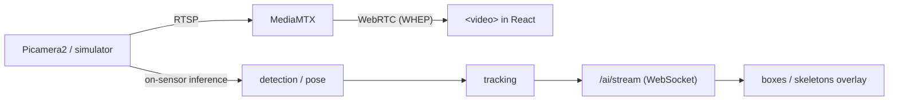

# Architecture

Diagrams are written as **Mermaid**: they render on GitHub/GitLab and stay in
version control as text. Update them when the architecture changes significantly
(`AGENTS.md` §22).

## 1. System architecture

**Key principle:** the frontend never touches the hardware. Every motion command
goes `API → RoverService → SafetyLayer → driver → Wi-Fi → WAVE ROVER`.

## 2. Motion control path

Stop is redundant on purpose: releasing the joystick, the Space key, the backend
watchdog, and `POST /rover/stop`.

## 3. Live-video and AI pipeline

Nothing is recorded: frames and detections live only in memory and are replaced
by the next result. See `docs/specs/live-video.md` and `docs/specs/ai-detection.md`.
